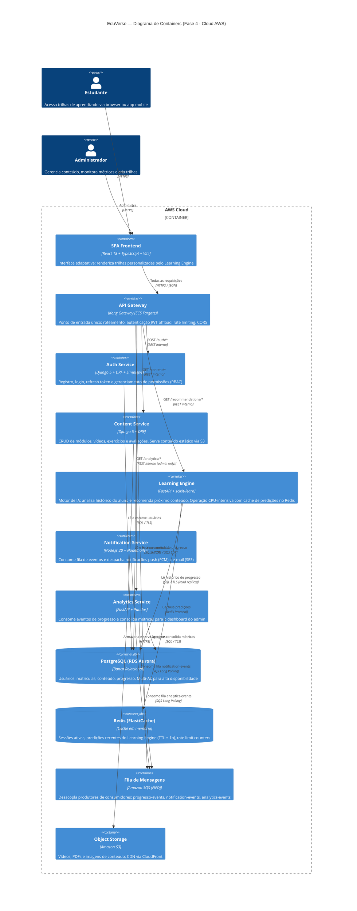

# EduVerse — Plataforma de Aprendizado Adaptativo com IA

> **Mini Projeto: O Arquiteto Decisor — Fase 3 (Cloud e Microsserviços)**  
> Disciplina: Arquitetura de Software | Prof. Carlos Gomes | UniEvangélica 2026.1

---

## Visão Executiva

O **EduVerse** é uma plataforma de aprendizado adaptativo que utiliza Inteligência Artificial para personalizar trilhas de conteúdo conforme o ritmo, desempenho e preferências de cada aluno. O problema central que o sistema resolve é a ineficiência do ensino padronizado: alunos diferentes aprendem de formas diferentes, mas a maioria das plataformas LMS entrega o mesmo conteúdo na mesma ordem para todos.

### Estado Atual — Fase 4 (Cloud e Microsserviços)

Na Fase 1 (Requisitos), o EduVerse foi modelado como um monólito Django com módulos de autenticação, gerenciamento de conteúdo e um motor de recomendação embutido. A Fase 2 (Modelagem) introduziu a separação em camadas e a escolha do estilo hexagonal. A **Fase 3**, entregue neste repositório, evolui a arquitetura para um modelo de **microsserviços na nuvem**, adotando:

- **PaaS (AWS)** como estratégia de nuvem principal, com ECS Fargate, RDS e ElastiCache (→ [ADR 0001](docs/adrs/0001-estrategia-nuvem.md))
- **API Gateway + Circuit Breaker + Bulkhead** como padrões de resiliência (→ [ADR 0002](docs/adrs/0002-padrao-resiliencia.md))
- **Modelo híbrido de comunicação**: REST síncrono para leitura e eventos assíncronos (SQS) para escrita (→ [ADR 0003](docs/adrs/0003-modelo-comunicacao.md))

---

## Diagrama C4 — Nível 2: Containers



---

## ADRs — Decisões Arquiteturais

| # | Título | Status |
|---|--------|--------|
| [ADR 0001](docs/adrs/0001-estrategia-nuvem.md) | Estratégia de Nuvem e Escalabilidade | Aceito |
| [ADR 0002](docs/adrs/0002-padrao-resiliencia.md) | Padrões de Resiliência | Aceito |
| [ADR 0003](docs/adrs/0003-modelo-comunicacao.md) | Modelo de Comunicação | Aceito |

Documento completo de arquitetura: [SAD — Fase 3](docs/sad/sad-fase3.md)

---

## Executando o Projeto Localmente

### Pré-requisitos

- Python 3.12+, Node.js 20+, Docker Desktop

### Backend (Auth Service ou Content Service — Django)

```bash
cd src/services/auth-service          # ou content-service
python -m venv .venv
# Windows:
.venv\Scripts\Activate.ps1
# Linux/macOS:
source .venv/bin/activate

pip install -r requirements.txt
cp .env.example .env                  # preencha as variáveis
python manage.py migrate
python manage.py runserver            # http://localhost:8000
```

### Learning Engine (FastAPI)

```bash
cd src/services/learning-engine
python -m venv .venv && source .venv/bin/activate
pip install -r requirements.txt
uvicorn app.main:app --reload         # http://localhost:8001
```

### Frontend (React + Vite)

```bash
cd src/frontend
npm install
cp .env.example .env.local            # configure VITE_API_URL
npm run dev                            # http://localhost:5173
```

### Subir infraestrutura local (Docker Compose)

```bash
docker compose up -d                   # PostgreSQL + Redis + RabbitMQ local
```

---

## Estrutura do Repositório

```
arquiteto-decisor/
├── src/                    # Código-fonte dos microsserviços
├── docs/
│   ├── adrs/               # Architecture Decision Records (0001, 0002, 0003)
│   ├── sad/                # Software Architecture Document
│   └── diagrams/           # Diagramas adicionais
├── gold-plating/           # Artefatos bônus
├── README.md
└── .gitignore
```

---

## Equipe

| Nome | Matrícula |
|------|-----------|
| Vitor Martins Melo | 2320023 |

---

*Cenário escolhido: **Cenário 4 — EduVerse: Aprendizado Adaptativo com IA***
